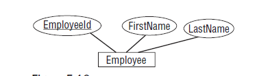
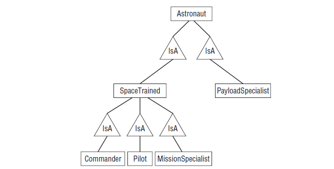

# Translating User Needs into Data Models

You have worked with customers to gain a full understanding of the problem at hand. The result should be a big pile of facts, goals, needs and requirements that should be part of the new database and its surrounding ecosystem. You may already have made some connections among various parts of this information, but mostly it should be a big heap of requirements that doesn't say too much about the database's design and construction.

This kind of pile of information is sometimes called a contextual list. It's basically just a list of important stuff (although it may be fairly elaborate and include requirements documents, diagrams, charts and all sorts of other supporting documentation)

The next step in turning the conceptual list into a database is converting it into a more formal model. You can compare the formal model to the contextual list and make sure that the model can handle all of your requirements.

## What are Data Models

A model is a plan. It's a blueprint for building something, in this case, a database. The purpose of the model isn't to do anything by itself. Instead, it gives you a concrete way to think about the database that you are going to build. By studying the pieces of the model, you can decide whether it represents all of the data that you need to meet your customers' needs.

A model is also useful for ensuring that everyone on the project has the same understanding of what needs to be done.

After you build a model, you can look at it and ask questions such as:
❑ Where do we store customer information?
❑ How many contact names can we store for a customer?
❑ Where do we store the contacts’ favorite colors?
❑ What if we need to store multiple price points for the same product?
❑ How do we store the seventeen kinds of addresses we need for customers?
❑ Where do we store supplier information?
❑ If someone asks about an order they placed but haven’t received, how can we figure out where
it is?

You should also work through any use cases or current scenarios and see if the model can handle them. The end users can help a lot with this part. Though they may not understand the models, they do understand their business and can ask these sorts of questions while you and other developers try to figure out if the model can handle them.

## Kinds of models

- First, a user interface model views the database at a very high level as seen from the final user's point of view. This model is very far from the final database implementation and it doesn't tell much about the database design. This model is useful for understanding what data is needed by the project and how you might use it to navigate through the user interface.
- The second and third types of models described are semantic object models and entity-relationship models. These are roughly at the same distance from the final database. They are at a slightly lower level than the user interface model and show relationships among data entities more explicitly. They are still at a moderately high logical level, however and do not provide quite enough detail to build the final database.
- The fourth type of model is the relational model. This model mimics the structure of a relational database closely enough that you can actually sit down and start building the database.

### User Interface Models

In most database applications, a user will eventually see the data in some form.For example, an order
entry and tracking application might use a series of screens where the user can perform such chores as
entering orders, tracking orders, marking an order as paid, looking up available inventory, and so forth.
Those screens form the database’s user interface.

Some databases don’t have their own user interfaces, at least not that a human will see. Some databases
are designed to store data for other applications to manipulate. In that case, it is the interfaces that those
other applications provide that the human user sees. If possible, you should consider what those applications
will need to display and plan accordingly.

You should also consider how those other applications will get the data from your database. The way in
which those applications interact with your database forms a non-human interface and you should plan
for that one, too.

To build the user interface model, start by making rough sketches of the screens that the user will see. Often these first sketches can come directly from paper forms if any exist.

A large application might include dozens or even hundreds of forms, each of which gives only a partial glimpse of the information contained in the database. Together these mocked-up screens form a user interface model that shines spotlights into the data needed to support the application.

With the user interface model in hand, you are now ready to build a more formal model that shows the entities used by the application in greater detail

### Semantic Object Models

A semantic object model (SOM) is intended to represent a system at a fairly high level. Though the ideas are somewhat technical, they still relate fairly closely to the way people think about things, so semantic object models are relatively understandable to users.

#### Classes and Objects

Intuitively, a semantic class is a type of thing you might want to represent in your system. This can include physical objects such as people, furniture, inventory items and invoices. It can also include logical abstractions such as report generators, tax years and work queues.

Technically, a semantic class is a named collection of attributes that are sufficient to identify a particular entity. A _semantic object_ (SO) is an instance of a semantic class. It is an entity instance that has all of the attributes defined by the class filled in.

Attributes come in 3 flavors: simple, group and object.

- A _simple attributes_ holds a simple value such as string, number or date.
- A _group attribute_ holds a composite value - a value that is composed of other values.
- An _object attribute_ holds a composite value - a value that is composed of other values.

##### cardinality

An attribute's cardinality tells how many values of that attribute an object might have.

##### Identifiers

An _object identifier_ is a group of one or more attributes that the users will typically use to identify an object in the class.

##### Semantic Views

Sometimes it is useful to define different views into the same data. Some of this information, such as your name and title is freely available to anyone who wants it.

Other semi-public information is available to anyone within the company but not outside the company.

Defining these different views allows you to make data available only to those who need it. After you finish building a complete semantic object model, you should check each of the views to ensure that they contain all of the information needed for each class of use and nothing else.

#### Class Types

##### Simple Objects

A simple atomic object is one that contains only single-valued simple attributes.

##### Composite Objects

A composite object contains at least one multi-valued, non-object attribute.

##### Compound Objects

A compound object contains at least one object attribute.

##### Hybrid Objects

A hybrid object contains a combination of the other kinds of attributes.

##### Association Objects

An association object represents a relationship between two other objects and stores extra information about the relationship.

##### Inherited Objects

Sometimes one class might share most of the characteristics of another class but with a few differences.

Semantic object models are fairly good at capturing the basic classes involved in a project, and through object attributes they do a decent job of showing which classes are related to other classes. However, they don't capture every possible scrap of information about a project.

Remember that the point of a semantic model (or any model for that matter) is to help you understand the problem. If the model alone doesn't capture the full scope of that problem, add comments, notes, attachments, video clips etc.

### Entity-Relationship Models

An entity-relationship diagram (ER diagram or ERD) is another form of object model that in many ways is similar to a semantic object model. It also allows you to represent objects and their relationships although it uses different symbols. ER diagrams also have a different focus, providing a bit more emphasis on relations and a bit less on class structure.

#### Entities, Attributes, and Identifiers

An entity is similar to a semantic object. It represents a specific instance of something that you want to track in the object model. Like semantic objects, an entity can be a physical thing (employee, work order,) or a logical abstraction ( appointment, discussion)

Similar entities are grouped into entity classes or entity sets. Like semantic objects, entities include attributes that describe the object that they represent.There are a couple of different methods for drawing entity sets. In the first method, a set is contained within a rectangle. Its attributes are drawn within ellipses and attached to the set with lines. If one of the attributes is an identifier (also called a key or primary key), its name is underlined.

A second approach is to draw entity sets in a manner similar to the one used by semantic object models
and then place only the set’s name in the ER diagram. Lines and other symbols, which are described
shortly, connect the entity sets to show their relationships. This approach allows you greater room for
listing attributes while removing them from the main ER diagram so it can focus on relationships.

#### Relationships

An ER diagram indicates a relationship with a diamond containing the relationship's name. The name is usually something very descriptive such as Contains, Works For, or Deceives, so often the relationship is perfectly understandable on its own. If the name isn't enough, you can add attributes to a relationship just as you can add them to entities: by placing the attribute in an ellipse and attaching it to the relationship with a line.

Note that every relation implicitly defines a reverse relation.

#### Cardinality

To add cardinality information, ER diagrams add one or more of three symbols to the lines leading in and out of entity sets. The three symbols are:
- ring: A ring means zero
- line: A short line means one
- crow's foot: A crow's foot  means many

#### Inheritance

Like a semantic object model, an ER diagram can represent inheritance. An ER diagram represents inheritance as a special relationship names IsA that's drawn inside a triangle. One point of the triangle points toward the parent class. Other lines leading into the triangle attach in the triangle's side.

#### Additional Conventions

ER diagrams use a few other conventions to add fine shades of meaning to a model. If every entity in an entity set must participate in the relationship, the diagram includes a thick or double line. This is called a participation constraint because each entity must participate.

A *weak entity* is one that cannot be identified by its attributes alone. In an ER diagram, you draw a weak entity with a thick rectangle and connect it to its identifying relationship with a thick arrow.

### Relational Models

Converting semantic object models and ER diagrams into a relational version isn't too difficult. To convert semantic object models and ER diagrams into relational models, you simply map the classes or entity sets to tables. You then figure out which columns in the tables form the foreign key relationships among the tables.

Each table's primary key is underlined. Lines connect the fields that form foreign key relationships. The number at the ends of these lines give the numbers of items participating in the relationship. In this example, all of the relationship are one-to-many relationships.

### Summary

Different kinds of models help define a problem. They identify the entities that are significant to the problem and they clarify the relationships among those entities. You can then use the models to test your understanding of the problem and to verify that the models provide the data you need to satisfy the problem's use cases and other requirements.
- Build user interface models to learn what kind of data the database will need to store
- Build semantic object models to study the objects that will interact while solving the problem
- Build entity-relationship diagrams to study the entities that are involved in the problem and to examine their interactions
- Convert semantic object models and entity-relationship diagrams into relational models.
