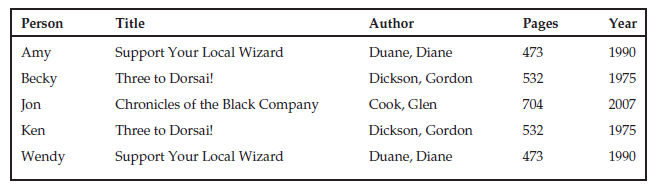

# Normalizing Data

Another way to make a database more flexible and robust is to 'normalize' it. Normalization makes the database more able to accommodate changes in the structure of the data. It also protects the database against certain kinds of errors.

## What Is Normalization?

Depending on how you design a relational database, it may be susceptible to all sorts of problems:

- It may contain lots of duplicated data. This not only wastes space but it also makes updating all of those duplicated values a time-consuming chore.
- It may incorrectly associate two unrelated pieces of data so you cannot delete one without deleting the other.
- It may require a piece of data that shouldn't exist in order to represent another piece of data that should exist.
- It may limit the number of values that you can enter for what should be a multi-valued piece of data.

Normalization is a process of rearranging the database to put it into a standard (normal) form that prevents these kinds of anomalies.

These are seven different levels of normalization. Each level includes those before it.

The different levels of normalization in order from weakest to strongest are:
❑ First Normal Form (1NF)
❑ Second Normal Form (2NF)
❑ Third Normal Form (3NF)
❑ Boyce-Codd Normal Form (BCNF)
❑ Fourth Normal Form (4NF)
❑ Fifth Normal Form (5NF)
❑ Domain/Key Normal Form (DKNF)

### First Normal Form (1NF)

First Normal Form basically says that data is in a database. Most of the properties needed to be in 1NF are enforced automatically by any reasonable relational database. There are a couple of extra properties added on to make the database more useful, but mostly these rules are pretty basic.

The official qualifications for 1NF are:

- Each column must have a unique name
- the order of the rows and columns doesn't matter
- Each column must have a single data type
- No two rows can contain identical values, thus every table should have a primary key
- Each column must contain a single value. This is the most tempting to violate. Sometimes a data entity includes a concept that needs multiple values. Storing multiple values in a single field limits the usefulness of that field. The solution is to break the multiple values apart, move them into a new table, and link those records back to this one with this record's primary key.
- Columns cannot contain repeating groups

### Second Normal Form (2NF)

A table is in 2NF if:

1. It is in 1NF
2. All of the non-key fields depend on all of the key fields.

Example:

Though this table is in 1NF, it is trying to do too much work all by itself.

First, the table is vulnerable to update anomalies. An update anomaly occurs when a change to a row leads to inconsistent data. In this case, update anomalies are caused by the fact that this table holds a lot of repeated data.

Second, this table is susceptible to deletion anomalies. A deletion anomaly occurs when deleting a record can destroy information you might need later.In this example, suppose you cancel the 3:30 match featuring Mike Acosta. In that case you lose the entire 7th record in the table, so you lose the fact that Mike is an amateur, that he’s ranked 6th, and even that he exists.

Third, this table is subject to insertion anomalies. An insertion anomaly occurs when you cannot store certain kinds of information because it would violate the table's primary key constraints.Suppose you want to add a new wrestler Nate Waffle to the roster but you have not yet scheduled any matches for him. To add Nate to this table, you would have to assign
him a wrestling match.Similarly, you cannot create a new time for a match without assigning a wrestler to it.

The underlying problem is that some of the table’s columns do not depend on all of the primary key fields

The solution is to pull the columns that do not depend on the entire primary key out of the table and put them in a new table. In this case, you could create a new Wrestlers table and move the Class and Rank fields into it. You would add a WrestlerName field to link back to the original table.

You should also verify that all of the new tables satisfy the 2NF rule.‘‘All of the non-key fields depend
on all of the key fields.’’

If you ensure that every table represents one single, unified concept such as wrestler or match, the table
will be in 2NF. It’s when a table tries to play multiple roles, such as storing wrestler and match information
at the same time, that it is open to data anomalies.

### Third Normal Form (3NF)

A table in 3NF if:

- It is in 2NF
- It contains no transitive dependencies

A transitive dependency is when one non-key field's value depends on another non-key field's value.

Examples

You can easily show that this table is 1NF. It uses a single field as primary key so every field in the table depends on the entire primary key, so its also 2NF.

However, this table contains a lot of duplication, so it is subject to modification anomalies. It's also subject to deletion anomalies and insertion anomalies.

The problem here is that some of the fields are related to others. In this example, Author, Pages, and Year
are related to Title. If you know a book’s Title, you could look up its Author, Pages, and Year. In this example, the primary key Person doesn't exactly drive the Author, Pages and Year fields. Instead it selects the Person's favorite Title and then Title determines the other values. This is a transitive dependency.

The main clue that there is a transitive dependency is that there are lots of duplicate values in the table.

You can fix this problem in a way similar to the way you put a table into 2NF: find the fields that are causing the problem and pull them into a separate table. Add an extra field to contain the original field on which those were dependent so you can link back to the original table.
In this case, you could make a Books table to hold the Author, Pages, and Year fields. You would then add a Title field to link the new records back to the original table.

### Stopping at Third Normal Form

Many database designers stop normalizing the database at 3NF because it provides the most bang for the buck. It's fairly easy to convert a database to 3NF and that level or normalization prevents the most common data anomalies. It stores separate data separately so you can add and remove pieces of information without destroying unrelated data. It also removes redundant data so the database isn't full of a zillion copies of the same information that waste space and make updating values difficult.

However, the database may still be vulnerable to some less common anomalies that are prevented by the more complicated normalizations described as below

### Boyce-Codd Normal Form (BCNF)

3NF does not deal satisfactorily with the case of a relation with overlapping candidate keys (i.e. Composite candidate keys with at least one attribute in common but BCNF is based on the concept of a determinant)

A determinant is any attribute (simple or composite) on which some other attribute is fully functionally dependent. Every determinant is a candidate key.

Recall that a `superkey` is a set of fields that contain unique values. You can use a `superkey` to uniquely identify the records in a table. Also recall that a candidate key is a minimal `superkey`. In other words, if you remove any of the fields from the candidate key, it won't be a `superkey` anymore.

A _determinant_ is a field that at least partly determines the value in another field. Note the definition of 3NF worries about fields that are dependent on another field that is not part of the primary key. Now we're talking about fields that might be dependent on fields that are part of the primary key (or any candidate key).

A table is in BCNF if

1. It is in 3NF
2. Every determinant is a candidate key

For any dependency A -> B, A should be a super key.

